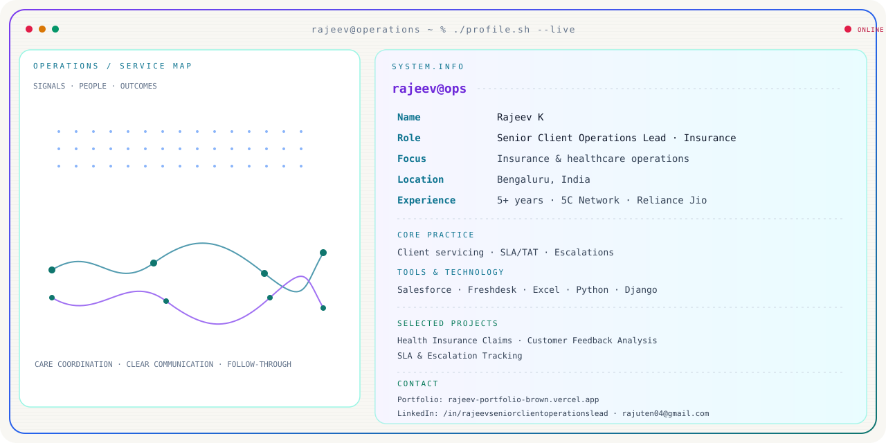

  <picture>
    <source media="(prefers-color-scheme: dark)" srcset="./profile-dark.svg">
    
  </picture>

  

<h2 align="center">Selected Work</h2>

  Health Insurance Claims
  &nbsp;·&nbsp;
  Customer Feedback Analysis
  &nbsp;·&nbsp;
  SLA &amp; Escalation Tracking

<h2 align="center">Certifications</h2>

  Deloitte Data Analytics Job Simulation &nbsp;·&nbsp;
  Python &amp; Django Full Stack Development &nbsp;·&nbsp;
  NCC “C” Certificate

  <a href="https://rajeev-portfolio-brown.vercel.app">Portfolio</a>
  &nbsp;·&nbsp;
  <a href="https://www.linkedin.com/in/rajeevseniorclientoperationslead/">LinkedIn</a>
  &nbsp;·&nbsp;
  <a href="mailto:rajuten04@gmail.com">Email</a>
  &nbsp;·&nbsp;
  <a href="https://github.com/rajuten04">GitHub</a>

